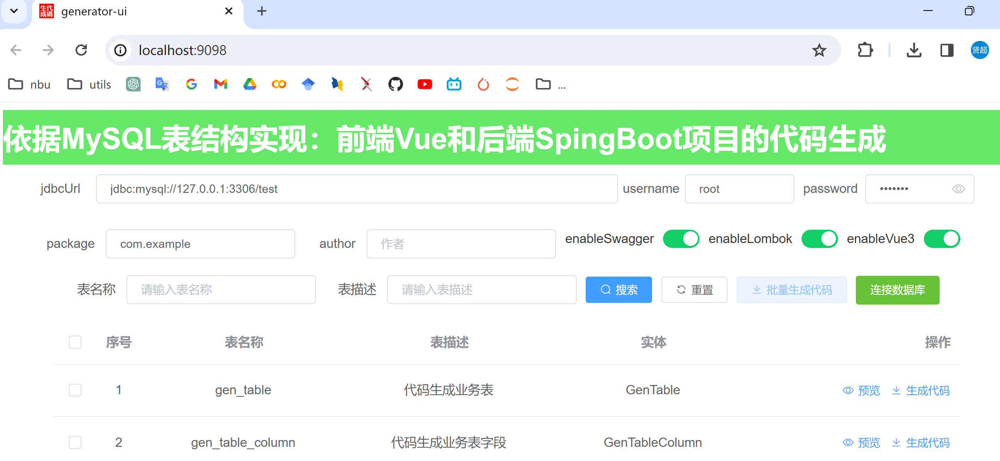

# generator
​	根据后端表结构，生成后端SpringBoot和前端Vue组件相关代码

***

​	PS：项目原始代码来源于[若依框架](https://gitee.com/y_project/RuoYi-Vue.git)，本人对[若依框架](https://gitee.com/y_project/RuoYi-Vue.git)代码生成部分进行单独提取并且进一步对代码生成模板进行更佳通用的适配修改，以至于不局限于[若依框架](https://gitee.com/y_project/RuoYi-Vue.git)内部使用。

***

## 项目拉取

```
git clone https://github.com/nhjclxc/generator.git
```


## 运行项目

### 运行后端

1. 进入后端项目

   ​	`cd generator`

2. 打包后端

   ​	`mvn clean package`

3. 启动

   ​	`java -jar generator-0.0.1-SNAPSHOT.jar` 
   ​	`nohup java -jar generator-0.0.1-SNAPSHOT.jar > nohup.log 2>&1 &` 

后端项目启动在9099端口


### 运行前端

1. 进入前端项目

   ​	`cd generator-ui`

2. 打包前端

   ​	`npm install`

3. 启动

   ​	`npm run serve` 

前端项目启动在9098端口


## 使用案例


